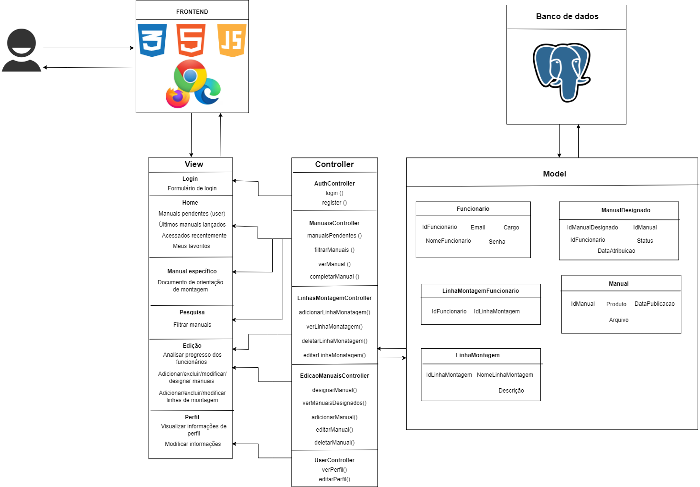

<h1 align="center">Edellcation - MVC</h1> 

- Nome do Projeto: Edellcation
- Descrição: Este projeto feito para a empresa Dell visa expor os manuais de instruções de montagens de aparelho em um único lugar para que o acesso por parte dos funcionários seja mais eficiente. Além disso, os administradores conseguem adicionar, deletar e designar manuais para funcionários e linhas de produção.
- Arquitetura: MVC (Model-View-Controller)
- Ferramenta de Diagramação: Draw.io

## Link de download Draw.io

https://drive.google.com/file/d/1JGIjmMhgOlTlXOuQi1maK4K8GXjRBLKa/view?usp=sharing

## MVC
### Modelos (Models):🗄️
**Manual:**
   - **IdManual:** Identificador do manual (chave primária).
   - **Produto:** Nome do produto que aquele manual se refere.
   - **Arquivo (ou link para o arquivo):** Link para download ou caminho do arquivo.
   - **Data de Publicação:** Data em que o manual foi publicado.

**Manual Designado**
   - **IdManualDesignado:** Identificador único do manual que foi atribuído (chave primária).
   - **IdFuncionario:** Identificador do funcionário associado ao manual (chave estrangeira referenciando a entidade Funcionario).
   - **IdManual:** Identificador do manual (chave estrangeira referenciando a entidade Manual).
   - **Status:** Status da leitura do manual (a fazer, em pregresso, concluído).
   - **Data de atribuição:** Data em que o manual foi atribuído ao funcionário.

**Funcionario:**
   - **IdFuncionario:** Identificados único de um funcionário 
   - **Nome:** Nome do funcionário.
   - **E-mail:** Endereço de e-mail corporativo do funcionário.
   - **Senha :** Senha criptografada do funcionário para login.
   - **Cargo** Definese o funcionário é um usuário comum ou um administrador.

**LinhaMontagemFuncionario**
   - **IdFuncionario:** Identificador do funcionário (chave estrangeira referenciando a entidade Funcionario).
   - **IdLinhaMontagem:** Identificador da linha de montagem (chave estrangeira referenciando a entidade LinhaMontagem).

**LinhaMontagem:**
   - **IdLinhaMontagem:** Identificador da linha de montagem (chave primária).
   - **NomeLinhaMontagem:** Nome da linha de montagem.
   - **Descrição:** Descrição da função da linha de montagem.

#### Relacionamentos:
- **Relacionamento entre Manual e Produto:**

    &nbsp;&nbsp;&nbsp;&nbsp;
Um manual está associado a um produto específico da empresa. Esse relacionamento permite que os funcionários encontrem facilmente os manuais relevantes para os produtos com os quais trabalham.

- **Relacionamento entre Manual Designado e Funcionário:**

    &nbsp;&nbsp;&nbsp;&nbsp;
Um manual designado está atribuído a um funcionário específico. Isso significa que o funcionário recebeu a tarefa de ler e compreender o conteúdo desse manual. Esse relacionamento permite que a empresa rastreie quais funcionários receberam quais manuais e monitora o progresso de leitura de cada funcionário.

- **Relacionamento entre Manual Designado e Manual:**

    &nbsp;&nbsp;&nbsp;&nbsp;
Um manual designado está vinculado a um manual específico. Isso significa que o funcionário recebeu uma versão específica do manual para leitura. Por exemplo, se um manual de montagem foi atualizado, uma nova entrada de manual designado pode ser criada para atribuir a nova versão aos funcionários. Esse relacionamento permite que a empresa mantenha o controle sobre as versões dos manuais distribuídos aos funcionários.

- **Relacionamento entre LinhaMontagemFuncionario e Funcionário:**

    &nbsp;&nbsp;&nbsp;&nbsp;
    A tabela LinhaMontagemFuncionario registra quais funcionários estão associados a quais linhas de montagem. Isso permite que a empresa saiba quais funcionários estão designados para trabalhar em quais linhas de montagem e quem são os responsáveis por cada etapa do processo de produção.

- **Relacionamento entre LinhaMontagemFuncionario e LinhaMontagem:**

    &nbsp;&nbsp;&nbsp;&nbsp;
    Essa tabela de associação estabelece a relação entre os funcionários e as linhas de montagem em que trabalham. Por exemplo, um funcionário pode ser designado para a linha de montagem "Montagem de Componentes Eletrônicos", e esse relacionamento é registrado na tabela LinhaMontagemFuncionario. Isso ajuda a empresa a distribuir eficientemente os recursos humanos e a garantir que cada linha de montagem tenha pessoal adequado para operar.

### Controladores (Controllers):🖲️

#### AuthController (Controlador de Autenticação)

- **login()**: Realiza a autenticação de um usuário.
  - Entrada: Credenciais de login (e-mail, senha).
  - Saída: Token de autenticação se as credenciais forem válidas.

- **registrar()**: Registra um novo usuário na aplicação.
  - Entrada: Dados do novo usuário (nome, e-mail, senha, cargo).
  - Saída: Confirmação de registro bem-sucedido ou mensagem de erro, detalhes do usuário registrado.

&nbsp;&nbsp;&nbsp;&nbsp;O `AuthController` é responsável por gerenciar as operações de autenticação e registro de usuários na aplicação. As ações `login()` e `registrar()` interagem com os modelos de usuário para autenticar os usuários existentes e registrar novos usuários, respectivamente. Após o login bem-sucedido, um token de autenticação é gerado e retornado para permitir o acesso às funcionalidades protegidas da aplicação.

#### ManuaisController (Controlador de Manuais)

- **manuaisPendentes()**: Recupera a lista de manuais pendentes para o usuário atual.
  - Entrada: Nenhuma.
  - Saída: Lista de manuais pendentes.

- **filtrarManuais(criterios)**: Filtra os manuais com base em critérios específicos.
  - Entrada: Critérios de filtragem (por exemplo, produto, tipo de manual).
  - Saída: Lista de manuais filtrados.

- **verManual(idManual)**: Recupera os detalhes de um manual específico.
  - Entrada: ID do manual desejado.
  - Saída: Detalhes do manual, incluindo conteúdo.

- **completarManual(idManual)**: Marca um manual como concluído para o usuário atual.
  - Entrada: ID do manual concluído.
  - Saída: Confirmação de conclusão do manual.

&nbsp;&nbsp;&nbsp;&nbsp;O `ManuaisController` é responsável por gerenciar as operações relacionadas aos manuais de treinamento na aplicação. As ações `manuaisPendentes()`, `filtrarManuais()`, `verManual()` e `completarManual()` permitem aos usuários acessar, filtrar, visualizar e marcar manuais como concluídos, respectivamente. Essas operações interagem com os modelos de manuais para recuperar e manipular os dados necessários.

#### LinhasMontagemController (Controlador de Linhas de Montagem)

- **adicionarLinhaMontagem()**: Adiciona uma nova linha de montagem ao sistema.
  - Entrada: Detalhes da nova linha de montagem (nome, descrição, etc.).
  - Saída: Confirmação de adição bem-sucedida da linha de montagem.

- **verLinhaMontagem()**: Recupera os detalhes de uma linha de montagem específica.
  - Entrada: ID da linha de montagem desejada.
  - Saída: Detalhes da linha de montagem, incluindo nome e descrição.

- **deletarLinhaMontagem()**: Deleta uma linha de montagem existente do sistema.
  - Entrada: ID da linha de montagem a ser deletada.
  - Saída: Confirmação de exclusão bem-sucedida da linha de montagem.

- **editarLinhaMontagem()**: Edita os detalhes de uma linha de montagem existente no sistema.
  - Entrada: ID da linha de montagem a ser editada e novos detalhes da linha de montagem (nome, descrição, etc.).
  - Saída: Confirmação de edição bem-sucedida da linha de montagem.

&nbsp;&nbsp;&nbsp;&nbsp;O `LinhasMontagemController` é responsável por gerenciar as operações relacionadas às linhas de montagem na aplicação. As ações `adicionarLinhaMontagem()`, `verLinhaMontagem()`, `deletarLinhaMontagem()` e `editarLinhaMontagem()` permitem aos usuários adicionar, visualizar, deletar e editar informações sobre as linhas de montagem, respectivamente. Essas operações interagem com os modelos de linha de montagem para recuperar e manipular os dados necessários.

#### EdicaoManuaisController (Controlador de Edição de Manuais)

- **designarManual()**: Atribui um manual específico a um funcionário.
  - Entrada: ID do manual e ID do funcionário.
  - Saída: Confirmação de atribuição bem-sucedida do manual ao funcionário.

- **verManuaisDesignados()**: Recupera a lista de manuais designados para um funcionário.
  - Entrada: ID do funcionário.
  - Saída: Lista de manuais designados para o funcionário.

- **adicionarManual()**: Adiciona um novo manual ao sistema.
  - Entrada: Detalhes do novo manual (nome, descrição, etc.).
  - Saída: Confirmação de adição bem-sucedida do manual.

- **editarManual()**: Edita os detalhes de um manual existente no sistema.
  - Entrada: ID do manual a ser editado e novos detalhes do manual (nome, descrição, etc.).
  - Saída: Confirmação de edição bem-sucedida do manual.

- **deletarManual()**: Deleta um manual existente do sistema.
  - Entrada: ID do manual a ser deletado.
  - Saída: Confirmação de exclusão bem-sucedida do manual.

&nbsp;&nbsp;&nbsp;&nbsp;O `EdicaoManuaisController` é responsável por gerenciar as operações relacionadas à edição de manuais na aplicação. As ações `designarManual()`, `verManuaisDesignados()`, `adicionarManual()`, `editarManual()` e `deletarManual()` permitem aos usuários atribuir, visualizar, adicionar, editar e deletar manuais, respectivamente. Essas operações interagem com os modelos de manual para recuperar e manipular os dados necessários.

#### UserController (Controlador de Usuário)

- **verPerfil()**: Recupera os detalhes do perfil do usuário.
  - Entrada: Nenhuma.
  - Saída: Detalhes do perfil do usuário, como nome, e-mail, cargo, etc.

- **editarPerfil()**: Permite ao usuário editar seu perfil.
  - Entrada: Novos detalhes do perfil do usuário (por exemplo, nome, e-mail, cargo).
  - Saída: Confirmação de edição bem-sucedida do perfil do usuário.

&nbsp;&nbsp;&nbsp;&nbsp;O `UserController` é responsável por gerenciar as operações relacionadas aos perfis dos usuários na aplicação. As ações `verPerfil()` e `editarPerfil()` permitem aos usuários visualizar e editar seus próprios perfis, respectivamente. Essas operações interagem com os modelos de usuário para recuperar e manipular os dados do perfil do usuário.

### Views (Views):👁️
- **Login**
   - Função: Permite que os usuários façam login na aplicação.

- **Home**
   - Função: Exibe uma visão geral das principais seções da aplicação.
     - Manuais pendentes (para o usuário logado): Mostra os manuais que ainda precisam ser lidos pelo usuário.
     - Últimos manuais lançados: Apresenta os manuais mais recentemente adicionados ao sistema.
     - Acessados recentemente: Mostra os manuais que foram acessados recentemente pelo usuário.
     - Meus favoritos: Exibe os manuais marcados como favoritos pelo usuário.

- **Manual específico (Documento de orientação de montagem)**
   - Função: Exibe detalhes específicos de um manual, incluindo o documento de orientação de montagem.

- **Pesquisa (Filtrar manuais)**
   - Função: Permite aos usuários filtrar os manuais com base em critérios específicos, como produto ou tipo de manual.

- **Edição**
   - Função: Permite a edição e gerenciamento de diferentes aspectos da aplicação.
     - Analisar progresso dos funcionários: Visualiza o progresso de leitura dos manuais por parte dos funcionários.
     - Adicionar/excluir/modificar/designar manuais: Permite adicionar, excluir, modificar e designar manuais para os funcionários.
     - Adicionar/excluir/modificar linhas de montagem: Permite adicionar, excluir e modificar linhas de montagem na fábrica.

- **Perfil**
   - Função: Permite aos usuários visualizar e modificar informações do seu perfil na aplicação.
     - Visualizar informações de perfil: Exibe as informações do perfil do usuário, como nome, e-mail, cargo, etc.
     - Modificar informações: Permite ao usuário modificar suas informações de perfil, como nome, e-mail, etc.

## Infraestrutura:

#### Bancos de Dados:
O projeto utiliza um banco de dados PostgreSQL relacional para armazenar dados importantes da aplicação, como informações de usuários, manuais e linhas de montagem. Cada modelo na arquitetura MVC representa uma tabela no banco de dados e é responsável por interagir com ela. Por exemplo, o modelo `Funcionario` interage com a tabela de funcionários no banco de dados, enquanto o modelo `Manual` interage com a tabela de manuais.

#### APIs Externas:
O projeto pode fazer uso de APIs externas ainda não definidas para funcionalidades específicas, como integração com serviços de autenticação, envio de e-mails, etc. As chamadas para essas APIs podem ser feitas dentro das camadas de controle ou modelo, dependendo da necessidade. Por exemplo, ao fazer login, o controlador pode chamar uma API externa para autenticar as credenciais do usuário.

#### Outras Dependências:
Além dos bancos de dados e APIs externas, o projeto pode depender de outras bibliotecas e ferramentas para diversas funcionalidades, como:
- Frameworks web, como Express.js (para Node.js), que ajudam na construção das rotas e manipulação das requisições HTTP.
- Bibliotecas de autenticação, como Passport.js, para gerenciar a autenticação dos usuários.

#### Integração com a Arquitetura MVC:
- Os modelos são responsáveis por interagir com o banco de dados, realizando operações de leitura, escrita, atualização e exclusão de dados.
- Os controladores recebem as requisições dos usuários, processam essas requisições e interagem com os modelos para acessar os dados necessários.
- As views são responsáveis por renderizar os dados fornecidos pelos controladores, criando a interface do usuário final.

Dessa forma, a infraestrutura do projeto, incluindo bancos de dados, APIs externas e outras dependências, se integra à arquitetura MVC de maneira a fornecer uma aplicação robusta e escalável, com uma separação clara de responsabilidades entre os diferentes componentes.

### Justificativa das Escolhas e Implicações da arquitetura:

1. **Node.js com Sails.js**: Node.js foi escolhido como base para o projeto devido à sua eficiência e escalabilidade no desenvolvimento de aplicações web em tempo real. Sails.js, um framework MVC para Node.js, foi selecionado por sua estrutura robusta, que facilita a organização do código e a implementação de funcionalidades complexas de forma simplificada. Essas escolhas proporcionam uma base sólida para o projeto, permitindo o desenvolvimento rápido e eficiente de uma aplicação web dinâmica e escalável.

    **Implicações da Arquitetura**: A arquitetura baseada em Node.js e Sails.js é altamente escalável, permitindo a distribuição eficiente de carga e o gerenciamento de grandes volumes de tráfego. A integração com o PostgreSQL oferece suporte a bancos de dados distribuídos e replicação para lidar com cargas de trabalho crescentes.

2. **PostgreSQL como Banco de Dados**: PostgreSQL foi adotado como o sistema de gerenciamento de banco de dados devido à sua confiabilidade, segurança e robustez. Como um banco de dados relacional de código aberto, o PostgreSQL oferece suporte a recursos avançados, como transações ACID e indexação eficiente, garantindo integridade e consistência dos dados. Sua integração perfeita com o Sails.js simplifica a interação com o banco de dados, permitindo uma modelagem eficaz e consultas otimizadas.

    **Implicações da Arquitetura**: A escolha do PostgreSQL como banco de dados proporciona confiabilidade, segurança e escalabilidade para a aplicação. Além disso, sua integração perfeita com o Sails.js simplifica a interação com o banco de dados, permitindo uma fácil implementação de modelos e consultas.

3. **HTML5, CSS3, Bootstrap e JavaScript para Front-end**: As tecnologias HTML5, CSS3, Bootstrap e JavaScript foram escolhidas para o front-end devido à sua ampla adoção e suporte em todos os principais navegadores. HTML5 e CSS3 oferecem uma base sólida para a estrutura e o estilo das páginas web, enquanto o Bootstrap fornece componentes e estilos pré-projetados para uma experiência de usuário consistente e responsiva. JavaScript é usado para adicionar interatividade e dinamismo às páginas, melhorando a experiência do usuário e tornando a aplicação mais atraente e funcional. Essas tecnologias combinadas permitem a criação de uma interface de usuário moderna e amigável, essencial para o sucesso da aplicação.

    **Implicações da Arquitetura**: A separação clara de responsabilidades na arquitetura MVC facilita a manutenção do código, permitindo que as alterações sejam feitas de forma isolada em modelos, controladores ou views. A arquitetura promove a testabilidade do código, pois separa as camadas de lógica de negócios, controle e apresentação.
